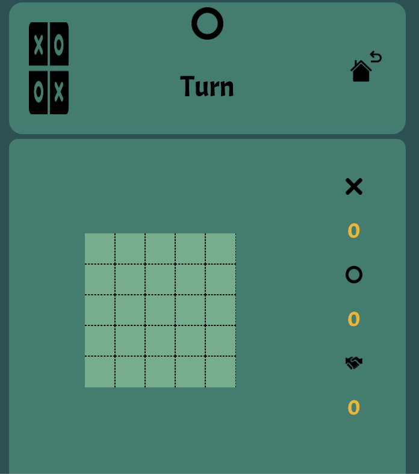

# Tic - Tac - Toe
---------------------------------------------

## Game description 
Two players take turns putting marks on the board. The goal of Tic Tac Toe game is to be one of the players to get a straight line of the same symbols in a row - horizontally, vertically or diagonally.
This Tic-tac-toe can be made significantly more complex by increasing the size of the board to 4-by-4 or 5-by-5.
Click on the cell you would like to make your move to place your icon.

-------------------------------------------
## Coding languages used
* JavaScript 
* CSS
* HTML

## You can play here
[Play](https://isabelsousac.github.io/Tic-Tac-Toe-Project0/)

## Librarie used
* [jQuery](https://jquery.com/)

---------------------------------------------
## Special Thanks
* Thank you to [The Blade](https://github.com/wofockham).
* Thank you to [Loden Gendun](https://github.com/Tenzang).